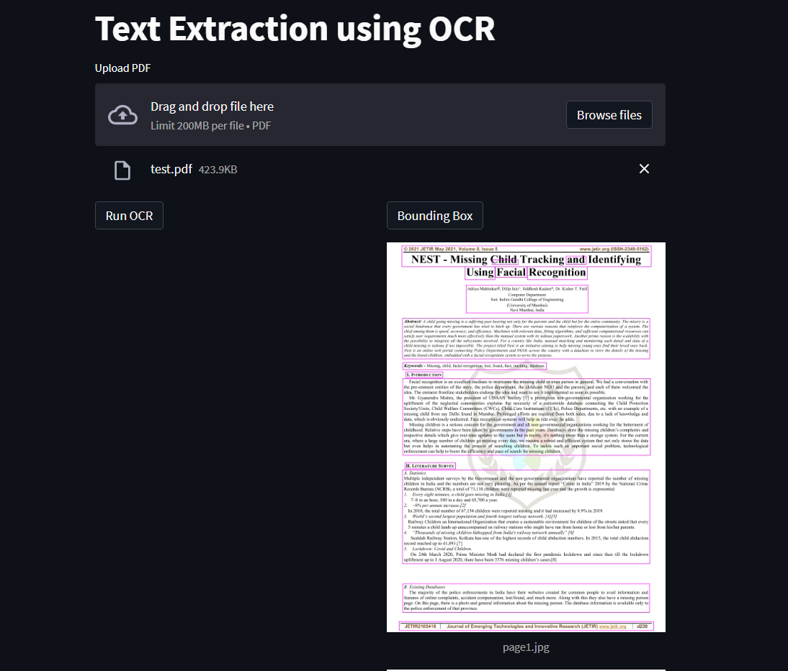
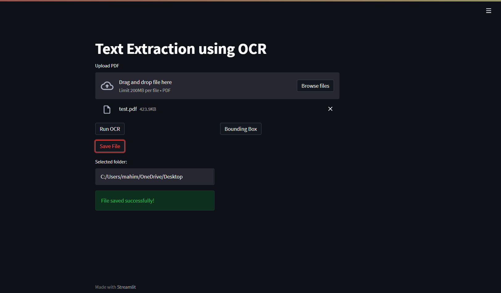
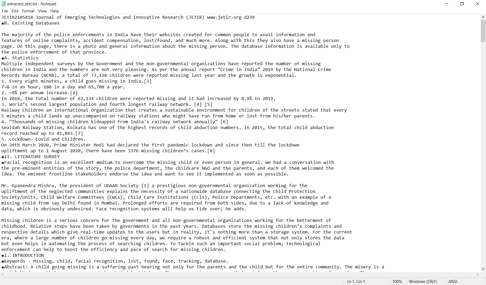

# PDF Extraction using Tesseract
## About
An OCR project as a Proof of Concept to deploy a machine learning project using Streamlit. The text extraction process is accompanied with image processing for better text recognition and achieving higher efficiency. 

## Libraries / Frameworks
- ### Streamlit - UI
- ### Tkinter - File download setup
- ### Pytesseract
- ### Pdf2Image
- ### OpenCV - Image Processing
   
## Code Execution
- ### Make sure you have Python 3.8 installed on the system.
- ### Open cmd where the contents are unzipped.
- ### Run the below command to install required packages.
    > pip install -r requirements.txt
- ### Install [Tesseract setup file](https://tesseract-ocr.github.io/tessdoc/Downloads.html)
- ### Download [poppler-0.68.0.7z](https://github.com/Priyanshiguptaaa/OCRLinguist/blob/main/poppler-0.68.0_x86.7z) and Extract file in C:\Program Files\poppler-0.68.0\
- ### Once all packages are installed, run the following command:
    > streamlit run OCR.py

If facing any issues, [contact me](mailto:marlon.labor.delatorre@gmail.com)

## Output

Bounding Box around recognized text

Text extraction and document saved

Extracted Text Output

